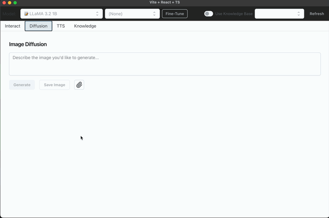
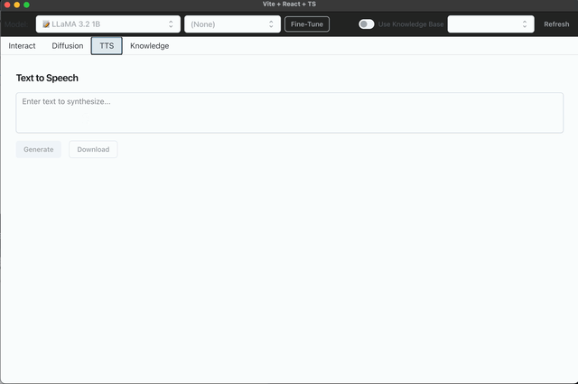
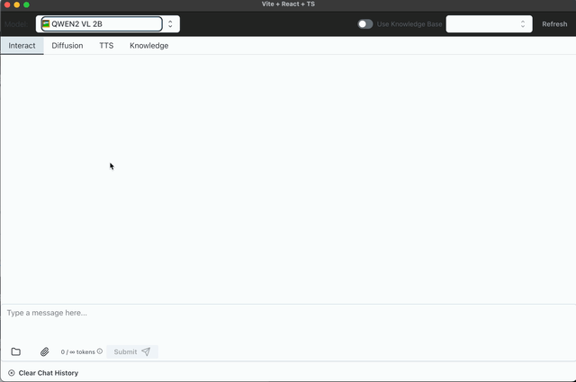
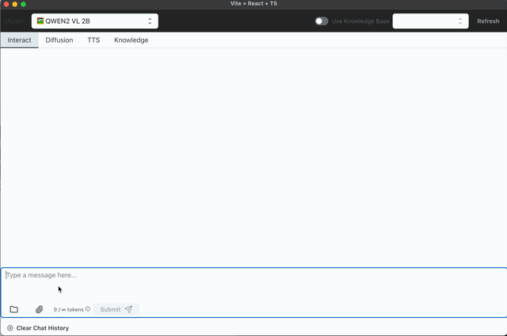
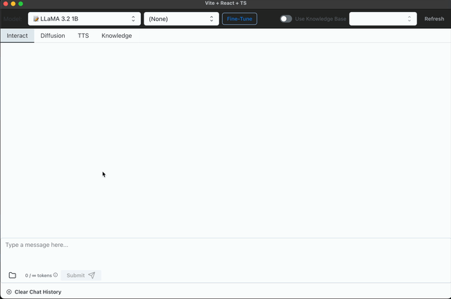

# 🧠 Chat App (Electron + React + FastAPI + Hugging Face + MLX + RAG)

This is a lightweight full-stack AI chat application with a modern **Electron + React + MUI frontend** and a **FastAPI + Hugging Face + MLX backend**.  
It now includes **Retrieval-Augmented Generation (RAG)** for grounded answers from your own documents.

---

## ✨ Features

### 💬 Conversational AI
- 🧠 Natural language conversation using Meta’s **LLaMA-3.2-1B-Instruct**
- 🖼️ Multimodal (text + image) reasoning with **Qwen2-VL-2B**
- 🗂️ File attachment for both text-only and multimodal models

### 🎨 Image Generation
- **Text-to-Image** and **Image-to-Image** generation via **Stable Diffusion XL (SDXL)** on Apple Silicon using MLX

### 🛠️ Fine-tuning
- LoRA fine-tuning for **LLaMA 3.2 1B** from the UI with your own datasets

### 🔈 Text-To-Speech
- Convert prompts to speech with local Tacotron2 + vocoder

### 📚 Knowledge Base (NEW — RAG)
- Ingest `.pdf`, `.csv`, `.txt`, `.md`/`.markdown` files into a **local FAISS vector store**
- Uses **sentence-transformers/all-MiniLM-L6-v2** embeddings (384-dim, MPS-friendly)
- Token-aware chunking (~850 tokens, 120 overlap) using the LLaMA tokenizer
- Store and search locally — **no external API calls required**
- Query via `/rag/query` to get grounded answers with **inline source citations**
- Manage from new **Knowledge Base tab** in the frontend:
  - Create indexes from uploaded files
  - List all indexes
  - **Delete entire index + its uploaded files** directly from the UI
- Uses clean, consistent Markdown rendering for RAG answers in chat bubbles

This project is fully optimized for **Apple Silicon** with native MPS-backed inference.

---

## Supported Models

This app supports text-only, multimodal (image + text), file + text, and image generation (diffusion) inference:

| Model                               | Type         | Notes                                             |
|------------------------------------|--------------|---------------------------------------------------|
| meta-llama/Llama-3.2-1B-Instruct   | Text-only    | Lightweight, fast local inference                 |
| mlx-community/Qwen2-VL-2B          | Multimodal   | Supports image + text joint reasoning             |
| Stable Diffusion XL (via MLX)      | Diffusion    | Supports text-to-image and image-to-image prompts |

## ✨ Features

### ✅ Frontend (Electron + React)
- Built with **Vite**, **TypeScript**, **MUI + Joy UI**
- Electron desktop app with a full‑width, tabbed interface
- Send **text**, **image + text**, and **file + text** (attach `.pdf`, `.csv`, `.txt`, `.md`)
- **Knowledge Base (RAG) tab** to upload documents, build local indexes, and delete entire indexes + their uploaded files
- **Diffusion** tab for generating and saving images  
  - Supports **text‑to‑image** and **image‑to‑image** workflows
- **TTS** tab for generating speech from text
- Fine‑tuning UI for the **LLaMA 3.2 1B** model with custom hyperparameters
- Talks to the backend via OpenAI‑compatible `/v1/chat/completions` and `/diffusion/generate` endpoints, plus `/rag/*` endpoints for retrieval

### ✅ Backend (FastAPI + Hugging Face + MLX)
- **FastAPI** server with CORS, hosting chat, diffusion, TTS, fine‑tuning, and **RAG** APIs
- Auto‑launches model workers (`model_worker.py`, `model_worker_qwen.py`) on startup
- Text & multimodal served via **`transformers.pipeline`** on **MPS (Apple Silicon)**, CUDA, or CPU
- Diffusion runs locally with **MLX Stable Diffusion XL** via subprocess (`txt2image.py`)
- TTS runs locally using `tts_models/en/ljspeech/tacotron2-DDC`
- **RAG**: local **FAISS** vector store with JSON metadata, token‑aware chunking (~850 tokens, 120 overlap), and **MiniLM‑L6** embeddings
- OpenAI‑style responses with token usage, base64 images for diffusion, and RAG answers with inline source citations
- Supports **LoRA fine‑tuning** of **LLaMA 3.2 1B** using your datasets

### Diffusion
#### Using a Reference Image
<div align="center">
  
</div>

#### Using Prompt Only
<div align="center">
  
</div>

### Text to Speech
<div align="center">
  
</div>

### Multimodal Inference
<div align="center">
  
</div>

### File Attachment (PDF/CSV)

Attach `.pdf` or `.csv` files via the 📁 button.

<div align="center">
  
</div>


## 🧠 Fine-Tuning Support (LLaMA 3.2 1B)

You can now **fine-tune the LLaMA model** using custom JSON datasets via the UI:

- Navigate to the `Interact` tab
- Select **LLaMA 3.2 1B** from the model dropdown
- Press the **Fine-Tune** button to open the training configuration modal
- Provide:
  - Name of the dataset (`.json` file placed under `./backend/datasets`)
  - Adapter name to save output under `./backend/adapters`
  - Hyperparameters like learning rate, epochs, and LoRA config (`r`, `alpha`, `dropout`)
- Once training finishes, the newly trained adapter becomes selectable from the "Adapter" dropdown
- The adapter will modify LLaMA’s behavior without retraining the entire base model

> This runs `finetune_llama.py` in the backend using Hugging Face Transformers + PEFT (LoRA) + your dataset.

<div align="center">
  
</div>

### Knowledge Base (RAG)

The new **Knowledge Base** tab allows you to upload `.pdf`, `.csv`, `.txt`, and `.md` files, index them locally using FAISS, and query them for grounded, citation-backed answers. You can also delete entire indexes along with their uploaded files.

<div align="center">
  
</div>

---

## 🧱 Folder Structure

```
chat-app/
├── backend/
│   ├── api.py
│   ├── fastchat_openai_api.py
│   ├── model_worker.py
│   ├── model_worker_qwen.py
│   ├── diffusion_worker.py
│   ├── finetune_llama.py
│   ├── tts_wrapper.py
│   ├── rag_router.py                # RAG API endpoints
│   ├── rag/                         # RAG core logic
│   │   ├── loaders.py               # PDF, CSV, TXT/MD parsers
│   │   ├── chunker.py               # Token-aware chunking
│   │   ├── embeddings.py            # MiniLM embeddings
│   │   ├── store_faiss.py           # FAISS store + metadata
│   │   ├── retriever.py             # Similarity search
│   │   ├── pipeline.py              # End-to-end RAG pipeline
│   │   └── schema.py                # Pydantic schemas for RAG
│   └── requirements.txt
└── frontend/
    ├── public/
    ├── src/
    │   ├── components/
    │   │   ├── KnowledgePage.tsx    # UI for uploading/querying/deleting indexes
    │   │   ├── ChatBubble.tsx
    │   │   ├── ChatPage.tsx
    │   │   ├── MainTabs.tsx
    │   │   ├── TTSPage.tsx
    │   │   └── DiffusionPage.tsx
    │   ├── lib/
    │   │   └── api.ts               # Frontend API calls (RAG + core endpoints)
    │   ├── App.tsx
    │   ├── main.tsx
    ├── electron/
    │   └── main.js
    ├── vite.config.ts
    ├── package.json
    ├── tsconfig.json
    ├── tsconfig.node.json    
    └── tsconfig.app.json      
```

---

## 🚀 Getting Started

### 🔧 1. Backend Setup

```bash
cd backend
python3 -m venv venv
source venv/bin/activate
pip install -r requirements.txt
```

#### 🖼️ Enable Image Diffusion (optional but recommended)

To use the Diffusion tab for image generation:
 - Clone the MLX examples repository:
 ```
 git clone https://github.com/ml-explore/mlx-examples.git
 ```
 - Open diffusion_worker.py and update this line to match your local path:
 ```
 TXT2IMG_SCRIPT = "/absolute/path/to/mlx-examples/stable_diffusion/txt2image.py"
 ```

Then launch the API with:

```bash
uvicorn api:app --host 0.0.0.0 --port 8000
```

This will auto-launch `model_worker.py` and `model_worker_qwen.py` if they are not already running.

> 💡 Make sure `torch`, `transformers`, and Apple MPS support are properly installed.
> 🧠 For image diffusion, you'll also need MLX and a Mac with Apple Silicon.
---

### 💻 2. Frontend Setup

```bash
cd frontend
npm install
```

#### Run for Development (with Electron)

```bash
npm run dev:electron
```

#### Build for Production

```bash
npm run build
```

---

## 🖥️ UI

- A model selector dropdown at the top allows switching between available models  
  (disabled in Diffusion and Knowledge Base tabs when not relevant).
- **Fine-tune** button opens a configuration modal to train LoRA adapters on custom data  
  (available when the **LLaMA 3.2 1B** model is selected).
- **Tab-based interface** with:
  - `Interact` tab  
    - Text and multimodal chat
    - Optionally use the **Knowledge Base** for RAG-augmented answers
    - Attach images (from file or URL) for multimodal prompts
    - Attach files (`.pdf`, `.csv`) for file-aware chat
  - `Knowledge Base` tab (**new**)  
    - Upload `.pdf`, `.csv`, `.txt`, or `.md` documents
    - Build local FAISS indexes from uploads
    - View all existing indexes with their chunk counts
    - Delete an entire index (and its uploaded files) directly from the UI
  - `Diffusion` tab  
    - Generate images from text prompts (**text-to-image**)
    - Optionally guide generation with a reference image (**image-to-image**)
    - Save generated images as PNG
  - `TTS` tab  
    - Generate speech audio from text
- Automatically scrolls to the latest message after assistant responses
- Renders assistant responses (including RAG answers) with clean, consistent Markdown formatting
- Displays base64-rendered images returned by the diffusion backend

## 📝 API

### 🔹 POST `/v1/chat/completions`

Used for LLM inference (text-only and multimodal).

**Request:**
```json
{
  "model": "meta-llama/Llama-3.2-1B-Instruct",
  "messages": [
    { "role": "user", "content": "Hello!" }
  ],
  "temperature": 0.7,
  "top_p": 1,
  "max_tokens": 512
}
```

**Response:**
```json
{
  "choices": [
    {
      "message": {
        "role": "assistant",
        "content": "Hi! How can I help you today?"
      }
    }
  ],
  "usage": {
    "prompt_tokens": 5,
    "completion_tokens": 12,
    "total_tokens": 17
  }
}
```

### 🎨 POST /diffusion/generate

Used for **text-to-image** and **image-to-image** generation via Stable Diffusion XL (SDXL) in MLX.

**Request:**
```json
{
  "prompt": "a futuristic cityscape at sunset",
  "image": "data:image/png;base64,... (optional)"
}
```

**Response:**
```json
{
  "image_url": "data:image/png;base64,iVBORw0KGgoAAAANSUhEUgAA..."
}
```

The returned base64 image will be rendered directly inside the frontend.

> 💡 Make sure you've set the TXT2IMG_SCRIPT path correctly and cloned mlx-examples.

## 📦 Dependencies

### Backend

- Multimodal prompts are parsed safely: base64 image data is extracted and excluded from tokenized text
- Prompts are truncated before formatting to respect model limits (32768 tokens)
- Backend routes are model-aware and extract text + image cleanly
- **RAG support**:
  - Local FAISS vector store
  - SentenceTransformers embeddings (`all-MiniLM-L6-v2`)
  - Token-aware chunking with LLaMA tokenizer
  - PDF/CSV/TXT/MD parsing

**Python packages:**
- `fastapi`
- `uvicorn`
- `transformers`
- `torch`
- `httpx`
- `mlx`
- `mlx-vlm`
- `mlx-lm`
- `Pillow`
- `requests`
- `sentencepiece`
- `protobuf`
- `faiss-cpu`  
- `sentence-transformers`
- `pypdf`
- `pandas`

---

### Frontend

- Core UI and chat rendering
- Electron desktop shell
- Markdown + code syntax highlighting for chat bubbles
- **RAG UI**: Knowledge Base management with index creation/deletion

**NPM packages:**
- `react`, `react-dom`
- `@mui/joy`, `@emotion/react`
- `electron`, `vite`
- `lucide-react`
- `react-markdown`, `rehype-raw`, `remark-gfm`
- `react-syntax-highlighter`
- `typescript`

---

## 🔐 License

Licensed under the Apache License, Version 2.0 (the "License"); you may not use this file except in compliance with the License. You may obtain a copy of the License at

[http://www.apache.org/licenses/LICENSE-2.0](http://www.apache.org/licenses/LICENSE-2.0)

Unless required by applicable law or agreed to in writing, software distributed under the License is distributed on an "AS IS" BASIS, WITHOUT WARRANTIES OR CONDITIONS OF ANY KIND, either express or implied. See the License for the specific language governing permissions and limitations under the License.
