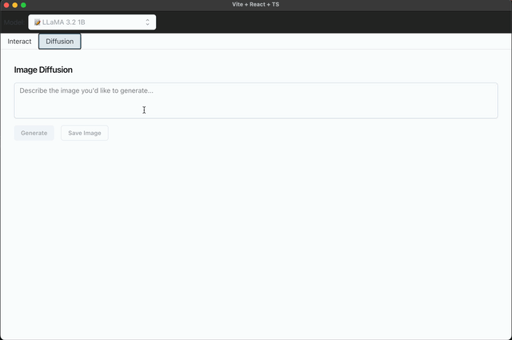
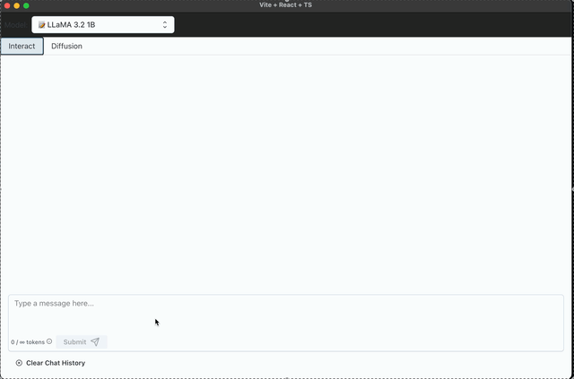

# 🧠 Chat App (Electron + React + FastAPI + Hugging Face)

This is a lightweight full-stack AI chat application with a modern **Electron + React + MUI frontend** and a **FastAPI + Hugging Face + MLX backend**. It supports:

- 🧠 Natural language conversation using Meta’s **LLaMA-3.2-1B-Instruct** model  
- 🖼️ Multimodal (text + image) understanding with MLX Community’s **Qwen2-VL-2B** model  
- 🎨 **Image generation (diffusion)** using **Stable Diffusion XL (SDXL)** via Apple’s **MLX** framework  

This project is fully optimized for **Apple Silicon** with native MPS-backed inference.

---

## Supported Models

This app supports text-only, multimodal (image + text), and image generation (diffusion) inference:

| Model                               | Type         | Notes                                             |
|------------------------------------|--------------|---------------------------------------------------|
| meta-llama/Llama-3.2-1B-Instruct   | Text-only    | Lightweight, fast local inference                 |
| mlx-community/Qwen2-VL-2B          | Multimodal   | Supports image + text joint reasoning             |
| Stable Diffusion XL (via MLX)      | Diffusion    | Generates high-quality images from text prompts   |

## ✨ Features

### ✅ Frontend (Electron + React)
- Built with **Vite**, **TypeScript**, **MUI + Joy UI**
- Electron desktop app with full-width tabbed interface
- Supports sending **text** and **image + text** inputs
- Includes a **Diffusion tab** for generating and saving images from prompts
- Communicates via OpenAI-compatible `/v1/chat/completions` and `/diffusion/generate` endpoints

### ✅ Backend (FastAPI + Hugging Face + MLX)
- **FastAPI** server with CORS, hosting both chat and diffusion APIs
- Automatically launches model workers (`model_worker.py`, `model_worker_qwen.py`) on startup
- Text + multimodal models use **`transformers.pipeline`** on **MPS (Apple Silicon)** or CPU
- Diffusion runs locally using **MLX Stable Diffusion XL** via subprocess (`txt2image.py`)
- Outputs OpenAI-style responses with token usage and returns base64 images from diffusion

### Diffusion


### Multimodal Inference

---

## 🧱 Folder Structure

```
chat-app/
├── backend/
│   ├── api.py
│   ├── fastchat_openai_api.py
│   ├── model_worker.py
│   ├── model_worker_qwen.py
│   ├── diffusion_worker.py
│   └── requirements.txt
└── frontend/
    ├── public/
    ├── src/
    │   ├── components/
    │   ├── App.tsx
    │   ├── main.tsx
    ├── electron/
    │   └── main.js
    ├── vite.config.ts
    ├── package.json
    └── tsconfig.json
    └── tsconfig.node.json    
    └── tsconfig.app.json    
```

---

## 🚀 Getting Started

### 🔧 1. Backend Setup

```bash
cd backend
python3 -m venv venv
source venv/bin/activate
pip install -r requirements.txt
```

#### 🖼️ Enable Image Diffusion (optional but recommended)

To use the Diffusion tab for image generation:
 - Clone the MLX examples repository:
 ```
 git clone https://github.com/ml-explore/mlx-examples.git
 ```
 - Open diffusion_worker.py and update this line to match your local path:
 ```
 TXT2IMG_SCRIPT = "/absolute/path/to/mlx-examples/stable_diffusion/txt2image.py"
 ```

Then launch the API with:

```bash
uvicorn api:app --host 0.0.0.0 --port 8000
```

This will auto-launch `model_worker.py` and `model_worker_qwen.py` if they are not already running.

> 💡 Make sure `torch`, `transformers`, and Apple MPS support are properly installed.
> 🧠 For image diffusion, you'll also need MLX and a Mac with Apple Silicon.
---

### 💻 2. Frontend Setup

```bash
cd frontend
npm install
```

#### Run for Development (with Electron)

```bash
npm run dev:electron
```

#### Build for Production

```bash
npm run build
```

---

## 🖥️ UI

- A model selector dropdown at the top allows switching between available models (disabled in Diffusion tab).
- **Tab-based interface** with:
  - `Interact` tab for text and multimodal chat
    - Supports attaching images (from file or URL) for multimodal prompts.
  - `Diffusion` tab for generating images from prompts
    - Includes a **Save Image** button in the Diffusion tab to download generated images as PNG files.
- Automatically scrolls to the latest message after assistant responses.
- Displays base64-rendered images returned by the diffusion backend.

## 📝 API

### 🔹 POST `/v1/chat/completions`

Used for LLM inference (text-only and multimodal).

**Request:**
```json
{
  "model": "meta-llama/Llama-3.2-1B-Instruct",
  "messages": [
    { "role": "user", "content": "Hello!" }
  ],
  "temperature": 0.7,
  "top_p": 1,
  "max_tokens": 512
}
```

**Response:**
```json
{
  "choices": [
    {
      "message": {
        "role": "assistant",
        "content": "Hi! How can I help you today?"
      }
    }
  ],
  "usage": {
    "prompt_tokens": 5,
    "completion_tokens": 12,
    "total_tokens": 17
  }
}
```

### 🎨 POST /diffusion/generate

Used for **image generation** via Stable Diffusion XL (SDXL) in MLX.

**Request:**
```json
{
  "prompt": "a futuristic cityscape at sunset"
}
```

**Response:**
```json
{
  "image_url": "data:image/png;base64,iVBORw0KGgoAAAANSUhEUgAA..."
}
```

The returned base64 image will be rendered directly inside the frontend.

> 💡 Make sure you've set the TXT2IMG_SCRIPT path correctly and cloned mlx-examples.

## 📦 Dependencies

### Backend

- Multimodal prompts are parsed safely: base64 image data is extracted and excluded from tokenized text.
- Prompts are truncated before formatting to respect model limits (32768 tokens).
- Backend routes are model-aware and extract text + image cleanly.

- `fastapi`
- `uvicorn`
- `transformers`
- `torch`
- `httpx`
- `mlx`
- `mlx-vlm`
- `mlx-lm`
- `Pillow`
- `requests`
- `sentencepiece`
- `protobuf`

### Frontend
- `react`, `react-dom`
- `@mui/joy`, `@emotion/react`
- `electron`, `vite`
- `lucide-react`, `react-markdown`, `rehype-raw`
- `typescript`

---

## 🔐 License

Licensed under the Apache License, Version 2.0 (the "License"); you may not use this file except in compliance with the License. You may obtain a copy of the License at

[http://www.apache.org/licenses/LICENSE-2.0](http://www.apache.org/licenses/LICENSE-2.0)

Unless required by applicable law or agreed to in writing, software distributed under the License is distributed on an "AS IS" BASIS, WITHOUT WARRANTIES OR CONDITIONS OF ANY KIND, either express or implied. See the License for the specific language governing permissions and limitations under the License.
