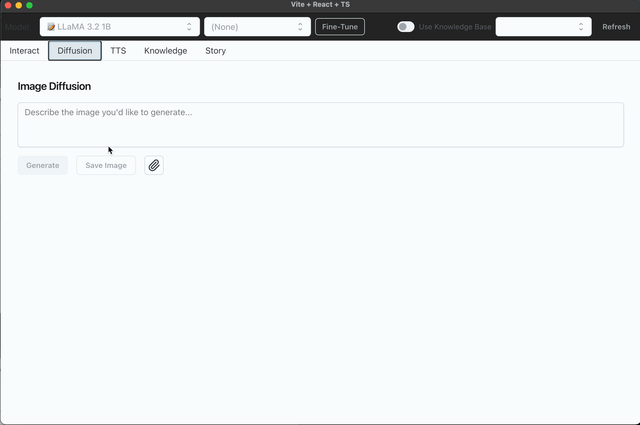
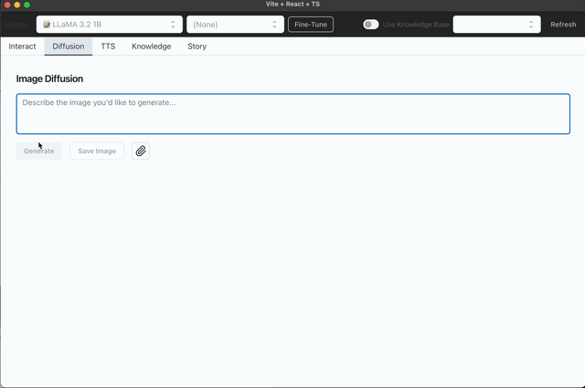
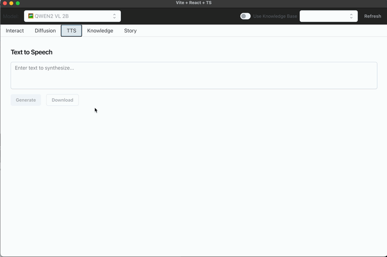
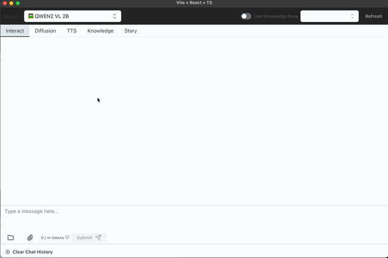
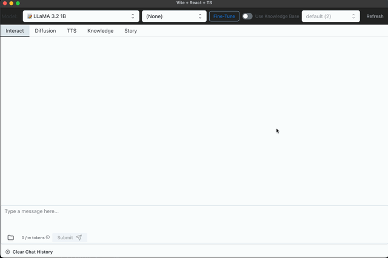
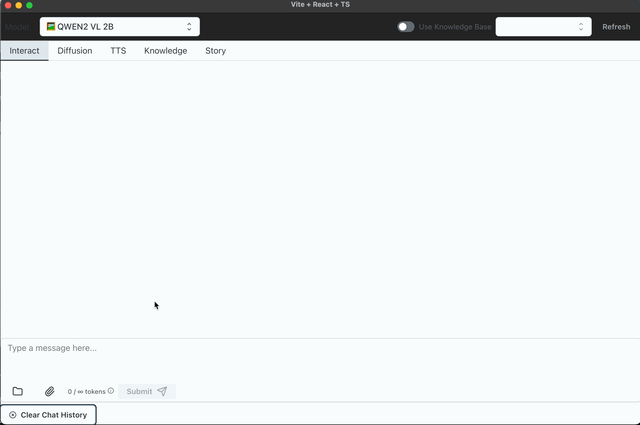
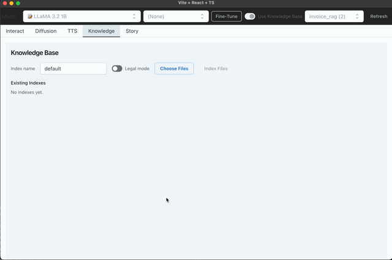
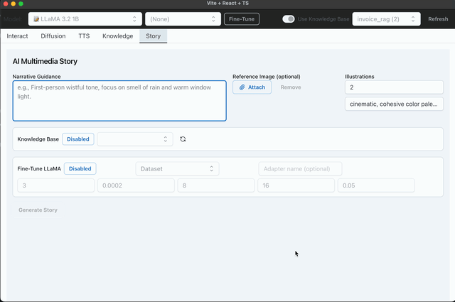

# 🧠 Chat App (Electron + React + FastAPI + Hugging Face + MLX + RAG + LangGraph Orchestration)

This is a lightweight full-stack AI chat application with a modern **Electron + React + MUI frontend** and a **FastAPI + Hugging Face + MLX backend**.  
It now includes:
- **Retrieval-Augmented Generation (RAG)** for grounded answers from your own documents.
- **LangGraph-based Multi-Model Orchestration** for complex, multimodal workflows.
- **On-Demand MLX Models (NEW)** — paste **any Hugging Face model ID** (text-generation) in the UI and the app spins up a dedicated **MLX worker** for it on the fly (downloads if needed, health-checked, isolated port, auto-routed). Switching back to a static model will gracefully **unload** the dynamic worker.

---

## ✨ Features

### 💬 Conversational AI
- 🧠 Natural language conversation using Meta’s **LLaMA-3.2-1B-Instruct**
- 🖼️ Multimodal (text + image) reasoning with **Qwen2-VL-2B**
- 🗂️ File attachment for both text-only and multimodal models
- 🔌 **On-Demand MLX Models (NEW)** — paste **any Hugging Face text-generation model ID** and the app spins up a dedicated **MLX worker** for it (downloaded if needed, health-checked, auto-routed). Switching back to a static model gracefully **unloads** the dynamic worker. *(Text-only causal LMs; multimodal remains Qwen-VL.)*

### 🎨 Image Generation
- **Text-to-Image** and **Image-to-Image** generation via **Stable Diffusion XL (SDXL)** on Apple Silicon using MLX

### 🛠️ Fine-tuning
- LoRA fine-tuning for **LLaMA 3.2 1B** from the UI with your own datasets

### 🔈 Text-To-Speech
- Convert prompts to speech with local Tacotron2 + vocoder

### 📚 Knowledge Base (RAG)
- Ingest `.pdf`, `.csv`, `.txt`, `.md`/`.markdown` files into a **local FAISS vector store**
- **Legal document mode** for `.pdf`:  
  - Parses clauses/sections based on legal numbering  
  - Resolves cross-references (e.g., “Section 3.2”) inline with source text  
  - Converts relative date phrases (e.g., “15 business days after the Effective Date”) into absolute dates  
  - Outputs a fully “materialized” document for improved retrieval accuracy  
- Uses **sentence-transformers/all-MiniLM-L6-v2** embeddings (384-dim, MPS-friendly)
- Token-aware chunking (~850 tokens, 120 overlap) using the LLaMA tokenizer
- Store and search locally — **no external API calls required**
- Query via `/rag/query` to get grounded answers with **inline source citations**
- Manage from new **Knowledge Base tab** in the frontend:
  - Create indexes from uploaded files, with optional legal mode for PDFs
  - List all indexes
  - **Delete entire index + its uploaded files** directly from the UI
- Uses clean, consistent Markdown rendering for RAG answers in chat bubbles

### 🎭 Storytelling Orchestration (NEW — LangGraph)
- End-to-end **AI Multimedia Story** generation pipeline powered by **LangGraph**
- Orchestrates multiple specialized models in sequence:
  1. **Qwen2-VL** — Understands and describes a reference image
  2. **(Optional) RAG** — Retrieves factual or contextual knowledge from your KB
  3. **(Optional) Fine-tuned LLaMA** — Writes a vivid, guided short story
  4. **SDXL** — Produces cohesive illustrations from story beats
  5. **TTS** — Narrates the final story in natural speech
- All steps are configurable from a dedicated **Story** tab:
  - Upload a reference image (optional)
  - Provide narrative tone/style guidance
  - Choose KB index for grounding (optional)
  - Enable LoRA fine-tuning before story generation (optional)
  - Set illustration count and style hints
- Output includes:
  - Scene summary
  - Full story text
  - Generated illustrations
  - Downloadable audio narration

This project is fully optimized for **Apple Silicon** with native MPS-backed inference.

---
## Architecture

### Supported Models

This app supports text-only, multimodal (image + text), file + text, and image generation (diffusion) inference:

| Model                                             | Type         | Notes                                                                                 |
|--------------------------------------------------|--------------|---------------------------------------------------------------------------------------|
| **meta-llama/Llama-3.2-1B-Instruct**             | Text-only    | Lightweight, fast local inference (static worker)                                     |
| **mlx-community/Qwen2-VL-2B**                    | Multimodal   | Image + text joint reasoning (static worker)                                          |
| **Stable Diffusion XL (via MLX)**                | Diffusion    | Text-to-image and image-to-image prompts                                              |
| **Any HF text-generation model via MLX (NEW)**   | Text-only    | **Paste a Hugging Face model ID** in the UI to spin up a dedicated MLX worker on demand|

**On-Demand MLX Models (examples that work well):**
- `mlx-community/TinyLlama-1.1B-Chat-v1.0-4bit`
- `mlx-community/Qwen2.5-0.5B-Instruct-4bit`
- `mlx-community/gemma-2-2b-it-4bit`

> **How it works:** Paste a valid **text-generation** (causal LM) HF ID → the backend launches an isolated MLX worker (downloads if needed), health-checks it, and routes chat to it automatically. Switching back to a static model **unloads** the dynamic worker. *(Multimodal remains Qwen-VL.)*

### ✅ Frontend (Electron + React)
- Built with **Vite**, **TypeScript**, **MUI + Joy UI**
- Electron desktop app with a full-width, tabbed interface
- **Model chooser with “Paste HF Model ID…” (NEW)** — paste any **Hugging Face text-generation** model ID to spin up an on-demand **MLX** worker; switching back to a static model unloads it
- Send **text**, **image + text**, and **file + text** (attach `.pdf`, `.csv`, `.txt`, `.md`)
- **Knowledge Base (RAG) tab** to upload documents, enable optional legal mode for PDFs, build local indexes, and delete entire indexes + their uploaded files
- **Diffusion** tab for generating and saving images  
  - Supports **text-to-image** and **image-to-image** workflows
- **TTS** tab for generating speech from text
- Fine-tuning UI for the **LLaMA 3.2 1B** model with custom hyperparameters
- **Story** tab for orchestrating multi-model AI workflows:  
  - Upload an optional reference image
  - Add narrative tone/style guidance
  - Select KB index for grounding (optional)
  - Enable LoRA fine-tuning before story generation (optional)
  - Configure number of illustrations and style hints
  - View scene summary, generated story, illustrations, and listen to the narrated audio
- Talks to the backend via:
  - OpenAI-compatible `/v1/chat/completions` (routes to static or dynamic workers; set `"model"` to the pasted HF ID to use the dynamic worker)
  - `/diffusion/generate`
  - `/rag/*` endpoints for retrieval
  - `/orchestrate_story` endpoint for LangGraph storytelling pipeline
  - **(NEW)** `/mlx/load` & `/mlx/unload` to manage on-demand MLX workers

### ✅ Backend (FastAPI + Hugging Face + MLX + LangGraph)
- **FastAPI** server with CORS, hosting chat, diffusion, TTS, fine-tuning, **RAG**, and orchestration APIs
- Auto-launches static model workers (`model_worker.py`, `model_worker_qwen.py`) on startup
- **Dynamic MLX worker (NEW)**:
  - `POST /mlx/load` — validates the pasted HF ID, picks a free port, spawns `dynamic_mlx_worker.py` (using `mlx_lm`), waits for `/health`, and registers `{model_id → port}`
  - `DELETE /mlx/unload` — terminates the spawned worker and unregisters it
  - Workers expose `/worker_generate` and are isolated per model on their own port
  - The OpenAI-style `/v1/chat/completions` **proxies** to static workers or to the dynamic worker based on the `"model"` field (exact HF ID)
  - Supports public models; private/gated repos require `HUGGING_FACE_HUB_TOKEN`
  - **Apple Silicon/MLX** required for dynamic workers
- Text & multimodal served via **`transformers.pipeline`** (static path) on **MPS (Apple Silicon)**, CUDA, or CPU; **dynamic** text models run via **`mlx_lm`** (MLX)
- Diffusion runs locally with **MLX Stable Diffusion XL** via subprocess (`txt2image.py`)
- TTS runs locally using `tts_models/en/ljspeech/tacotron2-DDC`
- **RAG**: local **FAISS** vector store with JSON metadata, token-aware chunking (~850 tokens, 120 overlap), and **MiniLM-L6** embeddings
- **LangGraph orchestration**:
  - Connects Qwen2-VL, optional RAG, optional LoRA-fine-tuned LLaMA, SDXL, and TTS into a single workflow
  - Handles all intermediate data passing and branching logic server-side
- OpenAI-style responses with token usage, base64 images for diffusion, and RAG answers with inline source citations
- Supports **LoRA fine-tuning** of **LLaMA 3.2 1B** using your datasets, configurable from the frontend

### Diffusion
#### Using a Reference Image
<div align="center">
  
</div>

#### Using Prompt Only
<div align="center">
  
</div>

### Text to Speech
<div align="center">
  
</div>

### Multimodal Inference
<div align="center">
  
</div>

### 🔌 On-Demand MLX Models (Paste HF ID) — NEW
Load **any Hugging Face text-generation model** at runtime:

1. In the **Interact** tab, open the model dropdown and select **“Paste HF Model ID…”**.  
2. Paste a repo like `mlx-community/TinyLlama-1.1B-Chat-v1.0-4bit` and click **Load**.  
3. Chat as usual — the app routes requests to a dedicated **MLX worker** for that model.  
4. Switching back to a static model (LLaMA or Qwen-VL) gracefully **unloads** the dynamic worker.

<div align="center">
  
</div>

> Works for text-only causal LMs on Apple Silicon (MLX). Private/gated models require `HUGGING_FACE_HUB_TOKEN`.

### File Attachment (PDF/CSV)

Attach `.pdf` or `.csv` files via the 📁 button.

<div align="center">
  
</div>


### 🧠 Fine-Tuning Support (LLaMA 3.2 1B)

You can now **fine-tune the LLaMA model** using custom JSON datasets via the UI:

- Navigate to the `Interact` tab
- Select **LLaMA 3.2 1B** from the model dropdown
- Press the **Fine-Tune** button to open the training configuration modal
- Provide:
  - Name of the dataset (`.json` file placed under `./backend/datasets`)
  - Adapter name to save output under `./backend/adapters`
  - Hyperparameters like learning rate, epochs, and LoRA config (`r`, `alpha`, `dropout`)
- Once training finishes, the newly trained adapter becomes selectable from the "Adapter" dropdown
- The adapter will modify LLaMA’s behavior without retraining the entire base model

> This runs `finetune_llama.py` in the backend using Hugging Face Transformers + PEFT (LoRA) + your dataset.

<div align="center">
  
</div>

### Knowledge Base (RAG)

The new **Knowledge Base** tab allows you to upload `.pdf`, `.csv`, `.txt`, and `.md` files, with optional legal mode for PDFs to resolve clause references and relative dates, index them locally using FAISS, and query them for grounded, citation-backed answers. You can also delete entire indexes along with their uploaded files.

<div align="center">
  
</div>

### 🎭 Storytelling Orchestration (NEW — LangGraph)

The **Story** tab introduces a complete **AI Multimedia Story** pipeline powered by LangGraph, combining multiple models in a coordinated flow:

1. **Qwen2-VL** — Analyzes and describes the uploaded reference image
2. **(Optional) RAG** — Retrieves factual/contextual knowledge from your Knowledge Base
3. **(Optional) LoRA Fine-tuned LLaMA** — Writes a vivid short story with your narrative style guidance
4. **Stable Diffusion XL** — Creates cohesive illustrations for key story moments
5. **Text-to-Speech** — Narrates the story in natural-sounding audio

**How to use:**
- Open the **Story** tab
- (Optional) Upload a reference image
- Enter narrative tone/style guidance
- (Optional) Select a KB index for grounding
- (Optional) Enable LoRA fine-tuning before story generation
- Choose number of illustrations and style hint
- Click **Generate Story**

The result includes:
- Scene summary  
- Complete story text  
- Generated illustrations  
- Downloadable audio narration

<div align="center">
  
</div>

---

## 🧱 Folder Structure

```
chat-app/
├── backend/
│   ├── api.py
│   ├── fastchat_openai_api.py
│   ├── story_orchestrator.py
│   ├── model_worker.py
│   ├── model_worker_qwen.py
│   ├── diffusion_worker.py
│   ├── finetune_llama.py
│   ├── tts_wrapper.py
│   ├── dynamic_mlx_worker.py
│   ├── dynamic_registry.py
│   ├── rag_router.py                # RAG API endpoints
│   ├── rag/                         # RAG core logic
│   │   ├── loaders.py               # PDF, CSV, TXT/MD parsers
│   │   ├── legal_processing.py      # Preprocessing legal documents
│   │   ├── chunker.py               # Token-aware chunking
│   │   ├── embeddings.py            # MiniLM embeddings
│   │   ├── store_faiss.py           # FAISS store + metadata
│   │   ├── retriever.py             # Similarity search
│   │   ├── pipeline.py              # End-to-end RAG pipeline
│   │   └── schema.py                # Pydantic schemas for RAG
│   └── requirements.txt
└── frontend/
    ├── public/
    ├── src/
    │   ├── components/
    │   │   ├── KnowledgePage.tsx    # UI for uploading/querying/deleting indexes
    │   │   ├── ChatBubble.tsx
    │   │   ├── ChatPage.tsx
    │   │   ├── ChatSubmit.tsx    
    │   │   ├── MainTabs.tsx
    │   │   ├── TTSPage.tsx
    │   │   └── DiffusionPage.tsx
    │   │   └── FineTuneModal.tsx    
    │   │   └── StoryPage.tsx    
    │   ├── lib/
    │   │   └── api.ts               # Frontend API calls (RAG + core endpoints)
    │   ├── App.tsx
    │   ├── main.tsx
    ├── electron/
    │   └── main.js
    ├── vite.config.ts
    ├── package.json
    ├── tsconfig.json
    ├── tsconfig.node.json    
    └── tsconfig.app.json      
```

---

## 🚀 Getting Started

### 🔧 1. Backend Setup

```bash
cd backend
python3 -m venv venv
source venv/bin/activate
pip install -r requirements.txt
```

#### 🖼️ Enable Image Diffusion (optional but recommended)

To use the Diffusion tab for image generation:
 - Clone the MLX examples repository:
 ```
 git clone https://github.com/ml-explore/mlx-examples.git
 ```
 - Open diffusion_worker.py and update this line to match your local path:
 ```
 TXT2IMG_SCRIPT = "/absolute/path/to/mlx-examples/stable_diffusion/txt2image.py"
 ```

Then launch the API with:

```bash
uvicorn api:app --host 0.0.0.0 --port 8000
```

This will auto-launch `model_worker.py` and `model_worker_qwen.py` if they are not already running.

> 💡 Make sure `torch`, `transformers`, and Apple MPS support are properly installed.
> 🧠 For image diffusion, you'll also need MLX and a Mac with Apple Silicon.
---

### 💻 2. Frontend Setup

```bash
cd frontend
npm install
```

#### Run for Development (with Electron)

```bash
npm run dev:electron
```

#### Build for Production

```bash
npm run build
```

---

## 🖥️ UI

- A model selector dropdown at the top allows switching between available models  
  (disabled in Diffusion, Knowledge Base, and Story tabs when not relevant).
- **Paste HF Model ID… (NEW):** from the model selector, choose **“Paste HF Model ID…”** to enter any Hugging Face **text-generation** repo (e.g., `mlx-community/TinyLlama-1.1B-Chat-v1.0-4bit`).  
  - The backend launches a dedicated **MLX worker** for that model (downloads if needed) and routes chats to it automatically.  
  - Switching back to a static model (LLaMA or Qwen-VL) **unloads** the dynamic worker.  
  - The selector shows the active pasted ID with a **(Dynamic MLX)** hint.
- **Fine-tune** button opens a configuration modal to train LoRA adapters on custom data  
  (available when the **LLaMA 3.2 1B** model is selected).
- **Tab-based interface** with:
  - `Interact` tab  
    - Text and multimodal chat
    - Optionally use the **Knowledge Base** for RAG-augmented answers
    - Attach images (from file or URL) for multimodal prompts
    - Attach files (`.pdf`, `.csv`) for file-aware chat
  - `Knowledge Base` tab  
    - Upload `.pdf`, `.csv`, `.txt`, or `.md` documents  
    - Optional legal mode for PDFs to resolve clause references and relative dates before indexing  
    - Build local FAISS indexes from uploads  
    - View all existing indexes with their chunk counts  
    - Delete an entire index (and its uploaded files) directly from the UI
  - `Diffusion` tab  
    - Generate images from text prompts (**text-to-image**)
    - Optionally guide generation with a reference image (**image-to-image**)
    - Save generated images as PNG
  - `TTS` tab  
    - Generate speech audio from text
  - `Story` tab (**new**)  
    - Upload an optional reference image
    - Provide narrative tone/style guidance
    - Optionally select a KB index for grounding
    - Optionally enable LoRA fine-tuning before story generation
    - Configure number of illustrations and style hint
    - View scene summary, full story text, generated illustrations, and listen to narrated audio
- Automatically scrolls to the latest message after assistant responses
- Renders assistant responses (including RAG answers) with clean, consistent Markdown formatting
- Displays base64-rendered images returned by the diffusion backend

## 📝 API

### 🔹 POST `/v1/chat/completions`

Used for LLM inference (text-only and multimodal).

**Request (static LLaMA or Qwen-VL):**
```json
{
  "model": "meta-llama/Llama-3.2-1B-Instruct",
  "messages": [
    { "role": "user", "content": "Hello!" }
  ],
  "temperature": 0.7,
  "top_p": 1,
  "max_tokens": 512
}
```

**Request (dynamic MLX model — NEW):**
```json
{
  "model": "mlx-community/TinyLlama-1.1B-Chat-v1.0-4bit",
  "messages": [
    { "role": "user", "content": "Hello!" }
  ],
  "temperature": 0.4,
  "top_p": 0.9,
  "max_tokens": 96
}
```

> Set `"model"` to the **exact HF ID** you loaded with `/mlx/load` (see below).  
> Dynamic MLX models are **text-only**; multimodal remains Qwen-VL.

**Multimodal message (Qwen-VL only):**
```json
{
  "model": "mlx-community/Qwen2-VL-2B",
  "messages": [
    {
      "role": "user",
      "content": [
        { "type": "text", "text": "What’s in this image?" },
        { "type": "image_url", "image_url": "data:image/png;base64,..." }
      ]
    }
  ]
}
```

**Response:**
```json
{
  "choices": [
    {
      "message": {
        "role": "assistant",
        "content": "Hi! How can I help you today?"
      }
    }
  ],
  "usage": {
    "prompt_tokens": 5,
    "completion_tokens": 12,
    "total_tokens": 17
  }
}
```

---

### 🔌 POST `/mlx/load` (NEW)

Launches an **on-demand MLX worker** for a pasted Hugging Face **text-generation** model ID.

**Request:**
```json
{
  "hf_model_id": "mlx-community/TinyLlama-1.1B-Chat-v1.0-4bit",
  "max_new_tokens": 96
}
```

**Response:**
```json
{
  "status": "loaded",
  "model": "mlx-community/TinyLlama-1.1B-Chat-v1.0-4bit",
  "port": 21100
}
```

> After this, set `"model"` to the exact HF ID in `/v1/chat/completions` to route chats to this worker.  
> Private/gated repos require `HUGGING_FACE_HUB_TOKEN` in the backend environment.  
> Requires Apple Silicon (MLX).

### 🔻 DELETE `/mlx/unload` (NEW)

Stops and unregisters a previously loaded dynamic MLX worker.

**Request:**
```json
{ "hf_model_id": "mlx-community/TinyLlama-1.1B-Chat-v1.0-4bit" }
```

**Response:**
```json
{ "status": "unloaded", "model": "mlx-community/TinyLlama-1.1B-Chat-v1.0-4bit" }
```

---

### 🎨 POST `/diffusion/generate`

Used for **text-to-image** and **image-to-image** generation via Stable Diffusion XL (SDXL) in MLX.

**Request:**
```json
{
  "prompt": "a futuristic cityscape at sunset",
  "image": "data:image/png;base64,... (optional)"
}
```

**Response:**
```json
{
  "image_url": "data:image/png;base64,iVBORw0KGgoAAAANSUhEUgAA..."
}
```

The returned base64 image will be rendered directly inside the frontend.

> 💡 Make sure you've set the TXT2IMG_SCRIPT path correctly and cloned `mlx-examples`.

---

### 🎭 POST `/orchestrate_story` (NEW)

Runs the **LangGraph storytelling orchestration** pipeline, connecting Qwen2-VL, optional RAG, optional fine-tuned LLaMA, SDXL, and TTS.

**Request**
```json
{
  "narrative": "first-person, nostalgic tone, focus on the smell of rain and warm light",
  "image": "data:image/png;base64,... (optional)",
  "rag_index_name": "default",
  "build_index": false,
  "finetune": false,
  "adapter_name": null,
  "num_epochs": 3,
  "learning_rate": 0.0002,
  "lora_r": 8,
  "lora_alpha": 16,
  "lora_dropout": 0.05,
  "num_illustrations": 2,
  "illustration_prompt_hint": "cinematic, cohesive color palette"
}
```

**Response**
```json
{
  "scene_summary": "A rainy street in a small town...",
  "story_text": "The rain came gently, tapping the window...",
  "illustrations": [
    "data:image/png;base64,...",
    "data:image/png;base64,..."
  ],
  "audio_wav_b64": "data:audio/wav;base64,...",
  "adapter_used": null,
  "rag_index_name": "default"
}
```

The frontend will:
- Render the scene summary and story text
- Display illustrations inline
- Provide an audio player for the narration

## 📦 Dependencies

### Backend

- Multimodal prompts are parsed safely: base64 image data is extracted and excluded from tokenized text
- Prompts are truncated before formatting to respect model limits (32768 tokens)
- Backend routes are model-aware and extract text + image cleanly
- **RAG support**:
  - Local FAISS vector store
  - SentenceTransformers embeddings (`all-MiniLM-L6-v2`)
  - Token-aware chunking with LLaMA tokenizer
  - PDF/CSV/TXT/MD parsing
- **LangGraph orchestration**:
  - Sequentially calls Qwen2-VL → optional RAG → optional LoRA fine-tuned LLaMA → SDXL → TTS
  - Manages intermediate data passing between models
  - Enforces CLIP token limits for SDXL prompts to prevent runtime errors  

**Python packages:**
- `fastapi`
- `uvicorn`
- `transformers`
- `torch`
- `httpx`
- `mlx`
- `mlx-vlm`
- `mlx-lm`
- `Pillow`
- `requests`
- `sentencepiece`
- `protobuf`
- `faiss-cpu`  
- `sentence-transformers`
- `pypdf`
- `pandas`
- `langgraph`

---

### Frontend

- Core UI and chat rendering
- Electron desktop shell
- Markdown + code syntax highlighting for chat bubbles
- **RAG UI**: Knowledge Base management with index creation/deletion

**NPM packages:**
- `react`, `react-dom`
- `@mui/joy`, `@emotion/react`
- `electron`, `vite`
- `lucide-react`
- `react-markdown`, `rehype-raw`, `remark-gfm`
- `react-syntax-highlighter`
- `typescript`

---

## 🔐 License

Licensed under the Apache License, Version 2.0 (the "License"); you may not use this file except in compliance with the License. You may obtain a copy of the License at

[http://www.apache.org/licenses/LICENSE-2.0](http://www.apache.org/licenses/LICENSE-2.0)

Unless required by applicable law or agreed to in writing, software distributed under the License is distributed on an "AS IS" BASIS, WITHOUT WARRANTIES OR CONDITIONS OF ANY KIND, either express or implied. See the License for the specific language governing permissions and limitations under the License.
